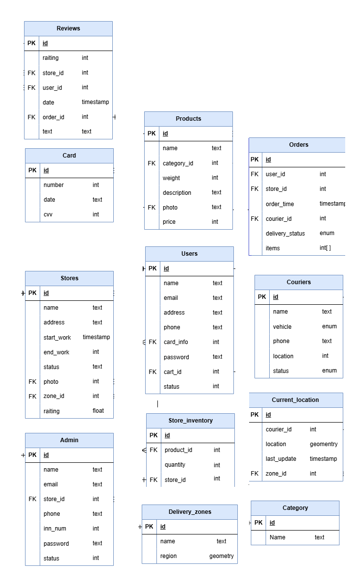
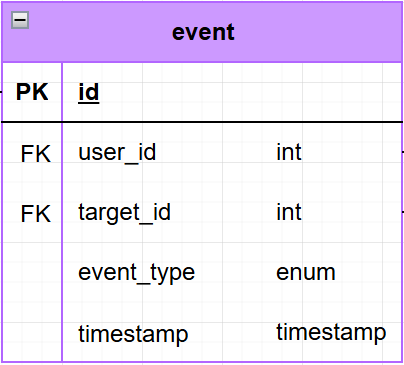
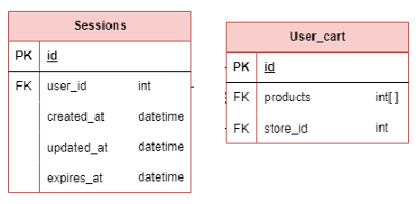
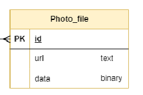
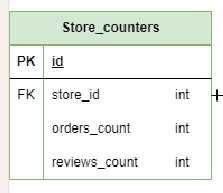

# VK-Highload-YandexEda
## 1. Тема и целевая аудитория
### Тема
Яндекс Еда — сервис заказа быстрой доставки еды из ресторанов и продуктов из магазинов.

### Целевая аудитория 
По официальной статистике 71% пользователей сервиса - это молодежь до 35 лет. Также в целевую аудиторию входят люди, не имеющие достаточно свободного времени, чтобы готовить самостоятельно, семьи и жители крупных городов. [^1]

### Аналоги

- Сбермаркет
- Самокат
- ВкусВилл
- Delivery club

### Число активных пользователей
Каждый месяц Яндекс Едой пользуется 15 млн пользователей в более чем 400 городах. Данная статистика актуальна на 2023 год. Ежегодный прирост количества пользователей по официальным данным составляет 42%. Учитывая данный прирост, можно сделать вывод, что количество активных пользователей в месяц продолжает расти и превысило 20 млн.[^2]

### Веб-трафик по странам

<em>Данные согласно сайту SimilarWeb</em>[^3]

### Веб-трафик по демографическим показателям

- 62,2% пользователей - мужчины
- 37,8% пользователей - женщины
- Основной процент аудитори приходится на молодых людей 25-34 лет (29,58%).
  
<em>Данные согласно сайту SimilarWeb</em>[^3]

### Ключевой функционал

- Просмотр рейтинга с ресторана 
- Регистрация и авторизация пользователей
- Поиск и выбор ресторанов
- Написание и чтение отзыва с оценкой
- Меню ресторанов
- Оформление заказа
- Онлайн-оплата
- Отслеживание заказа
- Уведомления
- Регистрация ресторана

### Ключевые продуктовые решения

- Интеграция с экосистемой Яндекс
- Разбиение зоны доставки на зоны с точками питания
- Подписка «Яндекс Плюс»

## 2. Расчет нагрузки
### Продуктовые метрики

#### Основные метрики
- **MAU (monthly active users)** - 15 000 000 пользователей[^2]
- **DAU (daily active users)** - 6 000 000 пользователей (данные посчитаны с помощью среднего значения Sticky Factor(отношение DAU к MAU) = 40%)

#### Средний размер хранилища пользователя

Для расчета хранилища необходимо определить вес ключевых данных. Возьмем среднюю заполненность данных, и при учете кодировки UTF-8 (от 1 до 4 байт, возьму 3 байта как среднее) получим:

**Профиль пользователя**

| Параметр                             | Вес                          |
| ------------------------------------ | ---------------------------- |
| Имя пользователя                     | 128 символов (3\*128=384 Б)  |
| Email                                | 255 символов (3\*255=765 Б)  |
| Адрес доставки                       | 512 символов (3\*512=1536 Б) |
| Аватар                               | 100 КБ                       |
| Уведомления (среднее 30)             | 30 \* 512 Б = 15 КБ          |
| **Итого**                            | **\~118 КБ**                 |

**Один заказ**

| Параметр                                     | Вес                |
| -------------------------------------------- | ------------------ |
| ID заказа                                    | 8 Б                |
| Дата и время заказа                          | 8 Б                |
| Список блюд (среднее 5 блюд, 100 Б на блюдо) | 5 \* 100 Б = 500 Б |
| Адрес доставки                               | 512 Б              |
| Статус заказа                                | 32 Б               |
| История обновлений статуса (5 записей)       | 5 \* 32 Б = 160 Б  |
| **Итого**                                    | **\~1,2 КБ**       |

Среднее количество заказов в день в сервисе составляет 1 млн заказов/день.[^4]

**Размер хранилища на 1 пользователя**:
- Среднее количество заказов за год: 120
- 120 \* 1,2 КБ = **144 КБ**
- Общий размер профиля + история заказов = **\~262 КБ**

#### Среднее количество действий пользователя в день
- Просмотр рейтинга ресторана: 15 раз в день.
- Поиск ресторанов: 3 раза в день.
- Чтение отзывов: 2.5 раз в день.
- Написание отзыва: 0.05 раза в день.
- Оформление заказа: 0.33 раз в день.
- Оплата заказа: 0.25 раз в день.
- Отслеживание заказа: 1 раза в день.
- Получение уведомлений: 5 раз в день.
- Просмотр меню: 15 раза в день.
- Просмотр ресторана: 15 раза в день
- Регистрация ресторана: 0.002 раза в день

#### Итоговая таблица
| Параметр                             | Значение                     |
| ------------------------------------ | ---------------------------- |
| Месячная аудитория                   | 15 млн человек               |
| Дневная аудитория                    | 3 млн человек                |
| Средний размер хранилища пользователя| \~262 КБ                     |
| Количество заказов в день            | 1 млн                        |
| Просмотр рейтинга ресторана          | 15 запросов/день              |
| Поиск ресторанов                     | 3 запросов/день              |
| Чтение отзывов                       | 2.5 запросов/день            |
| Написание отзыва                     | 0.05 запросов/день           |
| Оформление заказа                    | 0.33 запросов/день           |
| Оплата заказа                        | 0.25 запросов/день           |
| Отслеживание заказа                  | 1 запросов/день              |
| Получение уведомлений                | 5 запросов/день              |
| Просмотр меню                        | 15 запросов/день              |
| Просмотр ресторана                   | 15 запросов/день              |
| Регистрация ресторана                | 0.002 запросов/день          |

### Технические метрики

#### Данные ресторанов
- Количество ресторанов: 29 000[^5]
- Среднее количество позиций в меню: 73[^6]
- Данные на одну позицию меню:
  - Название блюда: 128 символов (384 Б)
  - Фото блюда: ~100 КБ
  - Описание блюда: 512 символов (1,5 КБ)
  - Цена: 8 Б
- Общий объем хранения данных ресторанов: 29 000 * 73 * (384 Б + 100 КБ + 1,5 КБ + 8 Б) = 211 ГБ

#### Размер хранения в разбивке по типам данных
Чтобы посчитать размер хранения сервиса "Яндекс еда" примерно посчитаем общее количество пользователей сервиса за счет среднего значения Retention Rate. В итоге получаем, что общее колдичество пользователей - 90 000 000 человек.

| Тип данных                                      | Размер                       |
| ----------------------------------------------- | ---------------------------- |
| Данные пользователей (90 млн \* 118 КБ)         | **9.89 ТБ**                   |
| Данные заказов (120 заказов \* 90 млн \* 1,2 КБ)| **12 ТБ**                     |
| Отзывы (среднее 1 отзыв на пользователя)        | **90 млн \* 512 Б = 42.9 ГБ** |
| Данные ресторанов (29 000 \* 73 позиций)        | **211 ГБ**                   |

#### Сетевой трафик

Посчитаем сетевой трафик для основных действий пользователя:

1. **Просмотр рейтинга ресторана**:
   - 15 запросов в день \* 1 КБ = **15 КБ** на пользователя.
   - Общий объем: 6 000 000 \* 15 КБ = **90 ГБ/день**.

2. **Поиск ресторанов**:
   - 3 запроса в день \* 10 КБ = **30 КБ** на пользователя.
   - Общий объем: 6 000 000 \* 30 КБ = **180 ГБ/день**.

3. **Чтение отзывов**:
   - 2.5 запросов в день \* 10 КБ = **25 КБ** на пользователя.
   - Общий объем: 6 000 000 \* 25 КБ = **150 ГБ/день**.

4. **Написание отзыва**:
   - 0.05 запроса в день \* 1 КБ = **0.05 КБ** на пользователя.
   - Общий объем: 6 000 000 \* 0.05 КБ = **0.3 ГБ/день**.

5. **Оформление заказа**:
   - 0.33 запроса в день \* 5 КБ = **1.65 КБ** на пользователя.
   - Общий объем: 6 000 000 \* 1.65 КБ = **9.9 ГБ/день**.

6. **Оплата заказа**:
   - 0.25 запроса в день \* 2 КБ = **0.5 КБ** на пользователя.
   - Общий объем: 6 000 000 \* 0.5 КБ = **3 ГБ/день**.

7. **Отслеживание заказа**:
   - 1 запрос в день \* 1 КБ = **1 КБ** на пользователя.
   - Общий объем: 6 000 000 \* 1 КБ = **6 ГБ/день**.

8. **Получение уведомлений**:
   - 5 запросов в день \* 512 Б = **2,5 КБ** на пользователя.
   - Общий объем: 6 000 000 \* 2,5 КБ = **15 ГБ/день**.

9. **Просмотр меню**:
   - 15 запроса в день \* 15 КБ = 225 КБ на пользователя.
   - Общий объем: 6 000 000 \* 225 КБ = **1 350 ГБ/день**.

10. **Просмотр ресторана**:
   - 15 запроса в день \* 8 КБ = 120 КБ на пользователя.
   - Общий объем: 6 000 000 \* 120 КБ = **720 ГБ/день**.

11. **Регистрация ресторана**:
    - 0.002 запроса в день \* 20 КБ = 0.04 КБ на пользователя.
    - Общий объем: 6000000 \* 0.04 КБ = **0.24 ГБ/день**.

**Потребление трафика**:
Возьмем, что пиковое значение превышает среднее в 2 раза.

| Тип трафика                     | Данные (ГБ/день) | Пиковое в Мбит/c | Суммарный суточный (ГБ/день) |
| ------------------------------- | ---------------- | ---------------- | ---------------------------- |
| Просмотр рейтинга ресторана     | 90               | 17.06            | 180                          |
| Поиск ресторанов                | 180              | 34.13            | 360                          |
| Чтение отзывов                  | 150              | 28.4             | 300                          |
| Написание отзыва                | 0.3              | 0.05             | 0.6                          |
| Оформление заказа               | 9.9              | 1.88             | 19.8                         |
| Оплата заказа                   | 3.0              | 0.57             | 6.0                          |
| Отслеживание заказа             | 6.0              | 1.13             | 12.0                         |
| Получение уведомлений           | 15.0             | 2.84             | 30.0                         |
| Просмотр меню                   | 1350             | 256              | 2700                         |
| Просмотр ресторана              | 720              | 136.5            | 1440                         |
| Регистрация ресторана           | 0.24             | 0.045            | 0.48                         |
| **Итого**                       | **2 542.44 ГБ**    | **478.605 Мбит/с** | **5 048.88 ГБ**              |

#### RPS (Requests Per Second)

Возьмем, что пиковое значение превышает среднее в 2 раза.

| Действие                    | RPS (средний)                       | RPS (пиковый)     |
| --------------------------- | ----------------------------------- | ----------------- |
| Просмотр рейтинга ресторана | 1040                                 | **2080**           |
| Поиск ресторанов            | 208                                 | **416**           |
| Чтение отзывов              | 173                                 | **346**           |
| Написание отзыва            | 3.5                                 | **7**             |
| Оформление заказа           | 23                                  | **46**            |
| Оплата заказа               | 17.4                                | **34.8**          |
| Отслеживание заказа         | 69.4                                | **138.8**         |
| Получение уведомлений       | 347                                 | **694**           |
| Просмотр меню               | 1040                                 | **2080**           |
| Просмотр ресторана          | 1040                                 | **2080**           |
| Регистрация ресторана       | 0.14                                | **0.28**          |
| **Итого**                   | **3 961.44**                        | **7 922.88**      |

## 3. Глобальная балансировка нагрузки
Возьмем распределение пользователей по странам [[hypestat]](https://hypestat.com/info/eda.yandex.ru)

Видим что большая часть пользователей приходится на Россию, далее Азербайджан, Германия, Нидерланды, США. С большой вероятностью пользователи из Германии, Нидерландов и США на самом деле не являются пользователями из ранее названных стран. Скорее всего это пользователи из СНГ, что забыли отключить ВПН. Будем считать что большая часть пользователей приходится на Россию и страны СНГ.

**Расположение дата-центров**:

На основе этих данных целесообразно расположить дата-центры в крупных городах, чтобы обеспечить минимальное время отклика для пользователей и стабильную работу сервиса.

**Россия:** Дата-центры стоит расположить в крупных городах с распределением по регионам страны:
- Москва (европейская часть России)
- Санкт-Петербург (северо-западная часть России)
- Новосибирск (сибирский регион)
- Владивосток (дальний восток)
  
**Беларусь:**
- Использует дата-центры из европейской части России

**Казахстан:**
- Астана (центр страны)

**Узбекистан:**
- Использует дата-центы из Казахстана

**Армения:**
- Использует дата-центы из Казахстана

Получаем такую карту:

### Распределение запросов по ДЦ
| RPS (Москва) | RPS (Санкт-Петербург) | RPS (Новосибирск) | RPS (Владивосток) |
|--------------|-----------------------|-------------------|-------------------|
| **1 188.432**| **1 188.432**         | **990.36**        | **594.216**       |

#### BGP
Используем BGP Anycast для присвоения одного IP-адреса нескольким дата-центрам в пределах одной страны. Это позволяет пользователям автоматически направляться к ближайшему по расположению дата-центру, что минимизирует задержки и повышает отказоустойчивость сети.

## 4.Локальная балансировка нагрузки

В нашей схеме балансировки запросы будут поступать на балансировщик уровня L7 (их будет в Москве - 3, в СПб - 3, Новосибирск - 3, Владивосток - 2), который будет быстро распределять трафик между серверами. Эти балансировщики L7 будут равномерно распределять запросы по конечным серверам, учитывая особенности запросов, такие как заголовки HTTP, куки или параметры маршрутизации. Межподовая балансировка будет осуществляться при помощи встроенного в k8s балансировщика нагрузки.

#### L7 балансировка

Будем использовать балансировку с помощью Nginx в роли прокси-сервера. Nginx будет принимать входящие HTTPS-запросы от клиентов и распределять их между различными серверами-бэкендами на основе URL или содержимого запросов. Таким образом, обеспечивается равномерное распределение нагрузки, оптимизация производительности и отказоустойчивость системы, что особенно важно при высоких пиковых нагрузках. SSL терминация также будет выполняться внутри Nginx.

## 5. Логическая схема БД

| Users                 | Sessions             | Card                  | Stores               | Store_inventory     | Products            | Orders              | Couriers              | Current_location     | Category              | Reviews              | User_cart           | Admin               | Photo_file          | Delivery_zones        | Event                | Store_counters        |
|-----------------------|----------------------|-----------------------|----------------------|---------------------|---------------------|---------------------|-----------------------|----------------------|-----------------------|----------------------|---------------------|---------------------|---------------------|-----------------------|----------------------|-----------------------|
| id (8 B)              | id (8 B)             | id (8 B)              | id (8 B)             | id (8 B)            | id (8 B)            | id (8 B)            | id (8 B)              | id (8 B)             | id (8 B)              | id (8 B)             | id (8 B)            | id (8 B)            | id (8 B)            | id (8 B)              | id (8 B)             | store_id (8 B)        |
| name (128 B)          | user_id (8 B)        | number (16 B)         | name (128 B)         | product_id (8 B)    | name (128 B)        | user_id (8 B)       | name (128 B)          | courier_id (8 B)     | name (128 B)          | rating (4 B)         | products (256 B)    | name (128 B)        | url (255 B)         | name (128 B)          | user_id (8 B)        | orders_count (8 B)    |
| email (255 B)         | created_at (8 B)     | date (8 B)            | address (255 B)      | quantity (8 B)      | category_id (8 B)   | store_id (8 B)      | vehicle (8 B)         | location (geometry)  |                       | store_id (8 B)       | store_id (8 B)      | email (255 B)       | data (8 B)          | region (geometry)     | target_id (8 B)      | reviews_count (8 B)   |
| address (255 B)       | updated_at (8 B)     | cvv (4 B)             | start_work (8 B)     | store_id (8 B)      | weight (8 B)        | order_time (8 B)    | phone (32 B)          | last_update (8 B)    |                       | user_id (8 B)        |                     | store_id (8 B)      |                     |                       | event_type (8 B)     |                       |
| phone (32 B)          | expires_at (8 B)     |                       | end_work (8 B)       |                     | description (512 B) | courier_id (8 B)    | location (geometry)   | zone_id (8 B)        |                       | date (8 B)           |                     | phone (32 B)        |                     |                       | timestamp (8 B)      |                       |
| card_info (8 B)       |                      |                       | status (4 B)         |                     | photo (8 B)         | delivery_status (4 B)| status (4 B)         |                      |                       | order_id (8 B)       |                     | inn_num (8 B)       |                     |                       |                      |                       |
| password (128 B)      |                      |                       | zone_id (8 B)        |                     | price (8 B)         | items (256 B)       |                       |                      |                       | text (1024 B)        |                     | password (128 B)    |                     |                       |                      |                       |
| status (4 B)          |                      |                       | rating (4 B)         |                     |                     |                     |                       |                      |                       |                      |                     | status (4 B)        |                     |                       |                      |                       |

### Итого

| Сущность           | Вес записи | Количество записей | Общий размер | Примечания |
|--------------------|------------|--------------------|--------------|------------|
| **Users**          | 531 B      | 90 000 000         | 45.79 GB     | Основная пользовательская база |
| **Sessions**       | 32 B       | 270 000 000/день   | 8.22 TB/год  | По 3 сессии/пользователя/день |
| **Card**           | 28 B       | 63 000 000         | 1.64 GB      | 70% пользователей с картами |
| **Stores**         | 555 B      | 29 000             | 15.03 GB     | Все рестораны сети |
| **Store_inventory**| 24 B       | 2 117 000          | 48.36 MB     | 73 продукта * 29K ресторанов |
| **Products**       | 692 B      | 2 117 000          | 1.38 TB      | Полный каталог продуктов |
| **Orders**         | 304 B      | 32 850 000/день    | 9.32 TB/год  | 0.365 заказов/пользователя/день |
| **Couriers**       | 300 B      | 3 000 000          | 858,3 MB     | Весь парк курьеров |
| **Current_location**| 32 B      | 3 000 000          | 91,5 MB      | GPS-позиции курьеров |
| **Category**       | 136 B      | 1 000              | 133 KB       | Категории меню |
| **Reviews**        | 1 052 B    | 4 500 000/день     | 4.43 TB/год  | 0.05 отзывов/пользователя/день |
| **User_cart**      | 272 B      | 90 000 000         | 23.38 GB     | Корзины всех пользователей |
| **Admin**          | 611 B      | 10 000             | 5.84 MB      | Персонал и модераторы |
| **Photo_file**     | 263 B      | 1 000 000          | 251 MB       | Фото блюд и ресторанов |
| **Delivery_zones** | 136 B      | 500                | 66 KB        | Зоны доставки |
| **Event**          | 40 B       | 270 000 000/день   | 10.07 TB/год | Системные события (3/польз./день) |
| **Store_counters** | 16 B       | 29 000             | 453 KB       | Статистика по ресторанам |

### RPS

| Entity            | Read RPS                                                          | Write RPS                                                   |
|------------------|----------------------------------------------------------------|-----------------------------------------------------------------|
| Users           | 2380 (Просмотр профиля)                                        | 1584 (Регистрация) + 1036 (Изменение данных) = 2620              |
| Sessions        | -                                                              | 1584 (Создание сессии)                                           |
| Card           | 794 (Просмотр привязанной карты)                               | 396 (Добавление карты) + 198 (Удаление карты) = 594               |
| Stores         | 1981 (Просмотр списка магазинов)                               | 792 (Добавление магазина) + 396 (Редактирование) = 1188           |
| Store_inventory| 1584 (Просмотр наличия товаров)                                | 990 (Обновление остатков)                                         |
| Products       | 3170 (Просмотр товаров)                                        | 396 (Добавление товара) + 198 (Редактирование) = 594              |
| Orders        | 1194 (Просмотр заказов)                                        | 1584 (Создание заказа) + 792 (Обновление статуса) = 2376           |
| Couriers       | 792 (Просмотр информации о курьере)                           | 396 (Регистрация курьера) + 198 (Изменение данных) = 594           |
| Current_location| 198 (Получение текущего местоположения)                       | 198 (Обновление местоположения)                                   |
| Category       | 396 (Просмотр категорий)                                       | 198 (Добавление категории)                                        |
| Reviews       | 1190 (Просмотр отзывов)                                        | 594 (Добавление отзыва)                                            |
| User_cart     | 1190 (Просмотр корзины)                                        | 1980 (Добавление в корзину) + 990 (Удаление из корзины) = 2970     |
| Admin         | 198 (Просмотр информации администратора)                       | 198 (Редактирование данных)                                        |
| Photo_file    | 396 (Просмотр фото)                                            | 198 (Загрузка фото)                                                |
| Delivery_zones| 396 (Просмотр зон доставки)                                    | 198 (Добавление зоны)                                              |
| Event         | 792 (Просмотр событий)                                         | 990 (Создание события) + 396 (Обновление события) = 1386           |
| Store_counters| 396 (Просмотр статистики)                                      | 198 (Обновление статистики)                                        |

## 6. Физическая схема БД

postgreSQL

Kafka

Redis

Amazon S3

ClickHouse

EllasticSearch

Таблицы _Products и _Stores

### Основные решения
**Выбор СУБД:**
* postgreSQL - для основных сущностей
* Redis - для таблиц с временными данными и необходимостью быстрого доступа к информации
* Amazon S3 - для хранения фото 
* ClickHouse - для хранения статистики магазинов
* Kafka - для обработки асинхронных задач и обмена сообщениями между сервисами

**Денормализация:**
* хранение рейтинга  магазина, хотя его можно вычеслить на основе Reviews
* Хранение Категорий в отедльной таблице, вместо enum типа

**Индексы:**
* Уникальный индекс для поля email таблицы users
  * Данный индекс необходим для регистрации/авторизации, когда нужно проверить, есть ли такой email в БД.
* Индекс на поле user_id таблицы Orders:
  * Для быстрого поиска всех заказов, сделанных конкретным пользователем.
* Индекс на поле category_id таблицы Products
  * Для ускорения поиска продуктов по категориям.
* Индекс на поле name таблицы Products
  * Для ускорения поиска продуктов по названию.
* Индекс на поле name таблицы Stores
  * Для ускорения поиска магазинов по названию.
* Индекс на поле store_id таблицы Reviews
  * Для ускорения поиска всех отзывов к одному магазину
* Индекс на поле status таблицы Couriers
  * Для ускорения поиска свобоных курьеров
* Индекс на поле store_id таблицы Products
  * Для ускорения поиска всех продуктов к одному магазину

**Шардирование и резервирование СУБД. Схема резервного копирования:**

Шардинг Корзины по user_id, Отзывы по store_id, Курьеры по delievery_zone, Продукты по store_id, Магазины по delievery_zone, остальные таблицы по id.

В качестве технологии резервного копирования будем использовать полное резервное копирование и инкрементное. Полное резервное копирование будем проводить раз в неделю, а инкрементное будет проходить каждый день. Такая комбинация позволяет минимизировать задержку при сбое основной системы хранения.

## Список источников

[^1]: [Яндекс Еда и Деливери поделилась статистикой по аудитории и онлайн-заказам](https://m.seonews.ru/events/yandeks-eda-i-deliveri-podelilas-statistikoy-po-auditorii-i-onlayn-zakazam/)
[^2]: [Сервис, который кормит миллионы пользователей](https://dev.go.yandex/services/eda)
[^3]: [Анализ трафика по SimilarWeb](https://pro.similarweb.com/#/digitalsuite/websiteanalysis/overview/website-performance/*/999/28d?webSource=Total&key=eda.yandex.ru)
[^4]: [«Яндекс» впервые раскрыл число заказов в сервисе «Яндекс.Еда»](https://vc.ru/food/55365-yandeks-vpervye-raskryl-chislo-zakazov-v-servise-yandekseda)
[^5]: [Что заказывают в Яндекс Еде?](https://yandex.ru/company/researches/2020/food)
[^6]: [Продающее меню. Способы его создания](https://traktir.ru/publications/14216/#:~:text=От%20концепции%20зависит%20и%20общее%20количество%20блюд.&text=Заведения%20русской%20кухни%20предполагают%20наличие,Больше%20позиций%20–%20не%20значит%20лучше!)

