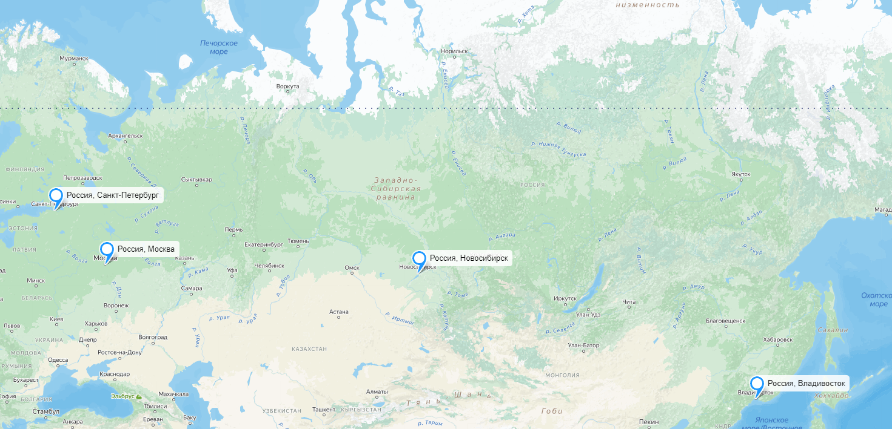
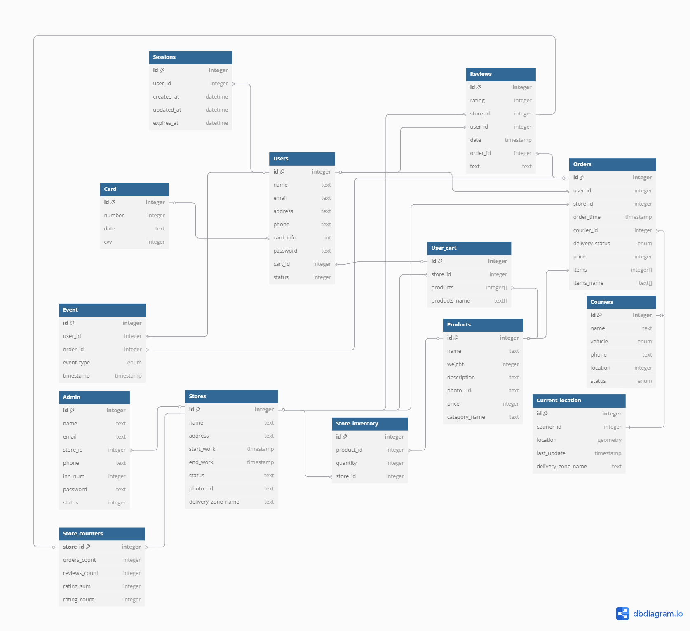

# VK-Highload-YandexEda
## 1. Тема и целевая аудитория
### Тема
Яндекс Еда — сервис заказа быстрой доставки еды из ресторанов и продуктов из магазинов.


### Целевая аудитория 
По официальной статистике 71% пользователей сервиса - это молодежь до 35 лет. Также в целевую аудиторию входят люди, не имеющие достаточно свободного времени, чтобы готовить самостоятельно, семьи и жители крупных городов. [^1]

### Аналоги

- Сбермаркет
- Самокат
- ВкусВилл
- Delivery club

### Число активных пользователей
Каждый месяц Яндекс Едой пользуется 15 млн пользователей в более чем 400 городах. Данная статистика актуальна на 2023 год. Ежегодный прирост количества пользователей по официальным данным составляет 42%. Учитывая данный прирост, можно сделать вывод, что количество активных пользователей в месяц продолжает расти и превысило 20 млн.[^2]

### Веб-трафик по странам

<em>Данные согласно сайту SimilarWeb</em>[^3]

### Веб-трафик по демографическим показателям

- 62,2% пользователей - мужчины
- 37,8% пользователей - женщины
- Основной процент аудитори приходится на молодых людей 25-34 лет (29,58%).
  
<em>Данные согласно сайту SimilarWeb</em>[^3]

### Ключевой функционал

- Просмотр рейтинга с ресторана 
- Регистрация и авторизация пользователей
- Поиск и выбор ресторанов
- Написание и чтение отзыва с оценкой
- Меню ресторанов
- Оформление заказа
- Онлайн-оплата
- Отслеживание заказа
- Уведомления
- Регистрация ресторана


### Ключевые продуктовые решения

- Интеграция с экосистемой Яндекс
- Разбиение зоны доставки на зоны с точками питания
- Подписка «Яндекс Плюс»

## 2. Расчет нагрузки
### Продуктовые метрики

#### Основные метрики
- **MAU (monthly active users)** - 15 000 000 пользователей[^2]
- **DAU (daily active users)** - 6 000 000 пользователей (данные посчитаны с помощью среднего значения Sticky Factor(отношение DAU к MAU) = 40%)

#### Средний размер хранилища пользователя

Для расчета хранилища необходимо определить вес ключевых данных. Возьмем среднюю заполненность данных, и при учете кодировки UTF-8 (от 1 до 4 байт, возьму 3 байта как среднее) получим:

**Профиль пользователя**

| Параметр                             | Вес                          |
| ------------------------------------ | ---------------------------- |
| Имя пользователя                     | 128 символов (3\*128=384 Б)  |
| Email                                | 255 символов (3\*255=765 Б)  |
| Адрес доставки                       | 512 символов (3\*512=1536 Б) |
| Аватар                               | 100 КБ                       |
| Уведомления (среднее 30)             | 30 \* 512 Б = 15 КБ          |
| **Итого**                            | **\~118 КБ**                 |

**Один заказ**

| Параметр                                     | Вес                |
| -------------------------------------------- | ------------------ |
| ID заказа                                    | 8 Б                |
| Дата и время заказа                          | 8 Б                |
| Список блюд (среднее 5 блюд, 100 Б на блюдо) | 5 \* 100 Б = 500 Б |
| Адрес доставки                               | 512 Б              |
| Статус заказа                                | 32 Б               |
| История обновлений статуса (5 записей)       | 5 \* 32 Б = 160 Б  |
| **Итого**                                    | **\~1,2 КБ**       |

Среднее количество заказов в день в сервисе составляет 1 млн заказов/день.[^4]

**Размер хранилища на 1 пользователя**:
- Среднее количество заказов за год: 120
- 120 \* 1,2 КБ = **144 КБ**
- Общий размер профиля + история заказов = **\~262 КБ**

#### Среднее количество действий пользователя в день
- Просмотр рейтинга ресторана: 15 раз в день.
- Поиск ресторанов: 3 раза в день.
- Чтение отзывов: 2.5 раз в день.
- Написание отзыва: 0.05 раза в день.
- Оформление заказа: 0.33 раз в день.
- Оплата заказа: 0.25 раз в день.
- Отслеживание заказа: 1 раза в день.
- Получение уведомлений: 5 раз в день.
- Просмотр меню: 15 раза в день.
- Просмотр ресторана: 15 раза в день
- Регистрация ресторана: 0.002 раза в день

#### Итоговая таблица
| Параметр                             | Значение                     |
| ------------------------------------ | ---------------------------- |
| Месячная аудитория                   | 15 млн человек               |
| Дневная аудитория                    | 3 млн человек                |
| Средний размер хранилища пользователя| \~262 КБ                     |
| Количество заказов в день            | 1 млн                        |
| Просмотр рейтинга ресторана          | 15 запросов/день              |
| Поиск ресторанов                     | 3 запросов/день              |
| Чтение отзывов                       | 2.5 запросов/день            |
| Написание отзыва                     | 0.05 запросов/день           |
| Оформление заказа                    | 0.33 запросов/день           |
| Оплата заказа                        | 0.25 запросов/день           |
| Отслеживание заказа                  | 1 запросов/день              |
| Получение уведомлений                | 5 запросов/день              |
| Просмотр меню                        | 15 запросов/день              |
| Просмотр ресторана                   | 15 запросов/день              |
| Регистрация ресторана                | 0.002 запросов/день          |

### Технические метрики

#### Данные ресторанов
- Количество ресторанов: 29 000[^5]
- Среднее количество позиций в меню: 73[^6]
- Данные на одну позицию меню:
  - Название блюда: 128 символов (384 Б)
  - Фото блюда: ~100 КБ
  - Описание блюда: 512 символов (1,5 КБ)
  - Цена: 8 Б
- Общий объем хранения данных ресторанов: 29 000 * 73 * (384 Б + 100 КБ + 1,5 КБ + 8 Б) = 211 ГБ

#### Размер хранения в разбивке по типам данных
Чтобы посчитать размер хранения сервиса "Яндекс еда" примерно посчитаем общее количество пользователей сервиса за счет среднего значения Retention Rate. В итоге получаем, что общее колдичество пользователей - 90 000 000 человек.

| Тип данных                                      | Размер                       |
| ----------------------------------------------- | ---------------------------- |
| Данные пользователей (90 млн \* 118 КБ)         | **9.89 ТБ**                   |
| Данные заказов (120 заказов \* 90 млн \* 1,2 КБ)| **12 ТБ**                     |
| Отзывы (среднее 1 отзыв на пользователя)        | **90 млн \* 512 Б = 42.9 ГБ** |
| Данные ресторанов (29 000 \* 73 позиций)        | **211 ГБ**                   |


#### Сетевой трафик

Посчитаем сетевой трафик для основных действий пользователя:

1. **Просмотр рейтинга ресторана**:
   - 15 запросов в день \* 1 КБ = **15 КБ** на пользователя.
   - Общий объем: 6 000 000 \* 15 КБ = **90 ГБ/день**.

2. **Поиск ресторанов**:
   - 3 запроса в день \* 10 КБ = **30 КБ** на пользователя.
   - Общий объем: 6 000 000 \* 30 КБ = **180 ГБ/день**.

3. **Чтение отзывов**:
   - 2.5 запросов в день \* 10 КБ = **25 КБ** на пользователя.
   - Общий объем: 6 000 000 \* 25 КБ = **150 ГБ/день**.

4. **Написание отзыва**:
   - 0.05 запроса в день \* 1 КБ = **0.05 КБ** на пользователя.
   - Общий объем: 6 000 000 \* 0.05 КБ = **0.3 ГБ/день**.

5. **Оформление заказа**:
   - 0.33 запроса в день \* 5 КБ = **1.65 КБ** на пользователя.
   - Общий объем: 6 000 000 \* 1.65 КБ = **9.9 ГБ/день**.

6. **Оплата заказа**:
   - 0.25 запроса в день \* 2 КБ = **0.5 КБ** на пользователя.
   - Общий объем: 6 000 000 \* 0.5 КБ = **3 ГБ/день**.

7. **Отслеживание заказа**:
   - 1 запрос в день \* 1 КБ = **1 КБ** на пользователя.
   - Общий объем: 6 000 000 \* 1 КБ = **6 ГБ/день**.

8. **Получение уведомлений**:
   - 5 запросов в день \* 512 Б = **2,5 КБ** на пользователя.
   - Общий объем: 6 000 000 \* 2,5 КБ = **15 ГБ/день**.

9. **Просмотр меню**:
   - 15 запроса в день \* 15 КБ = 225 КБ на пользователя.
   - Общий объем: 6 000 000 \* 225 КБ = **1 350 ГБ/день**.

10. **Просмотр ресторана**:
   - 15 запроса в день \* 8 КБ = 120 КБ на пользователя.
   - Общий объем: 6 000 000 \* 120 КБ = **720 ГБ/день**.

11. **Регистрация ресторана**:
    - 0.002 запроса в день \* 20 КБ = 0.04 КБ на пользователя.
    - Общий объем: 6000000 \* 0.04 КБ = **0.24 ГБ/день**.

**Потребление трафика**:
Возьмем, что пиковое значение превышает среднее в 2 раза.

| Тип трафика                     | Данные (ГБ/день) | Пиковое в Мбит/c | Суммарный суточный (ГБ/день) |
| ------------------------------- | ---------------- | ---------------- | ---------------------------- |
| Просмотр рейтинга ресторана     | 90               | 17.06            | 180                          |
| Поиск ресторанов                | 180              | 34.13            | 360                          |
| Чтение отзывов                  | 150              | 28.4             | 300                          |
| Написание отзыва                | 0.3              | 0.05             | 0.6                          |
| Оформление заказа               | 9.9              | 1.88             | 19.8                         |
| Оплата заказа                   | 3.0              | 0.57             | 6.0                          |
| Отслеживание заказа             | 6.0              | 1.13             | 12.0                         |
| Получение уведомлений           | 15.0             | 2.84             | 30.0                         |
| Просмотр меню                   | 1350             | 256              | 2700                         |
| Просмотр ресторана              | 720              | 136.5            | 1440                         |
| Регистрация ресторана           | 0.24             | 0.045            | 0.48                         |
| **Итого**                       | **2 542.44 ГБ**    | **478.605 Мбит/с** | **5 048.88 ГБ**              |


#### RPS (Requests Per Second)

Возьмем, что пиковое значение превышает среднее в 2 раза.

| Действие                    | RPS (средний)                       | RPS (пиковый)     |
| --------------------------- | ----------------------------------- | ----------------- |
| Просмотр рейтинга ресторана | 1040                                 | **2080**           |
| Поиск ресторанов            | 208                                 | **416**           |
| Чтение отзывов              | 173                                 | **346**           |
| Написание отзыва            | 3.5                                 | **7**             |
| Оформление заказа           | 23                                  | **46**            |
| Оплата заказа               | 17.4                                | **34.8**          |
| Отслеживание заказа         | 69.4                                | **138.8**         |
| Получение уведомлений       | 347                                 | **694**           |
| Просмотр меню               | 1040                                 | **2080**           |
| Просмотр ресторана          | 1040                                 | **2080**           |
| Регистрация ресторана       | 0.14                                | **0.28**          |
| **Итого**                   | **3 961.44**                        | **7 922.88**      |


## 3. Глобальная балансировка нагрузки
Возьмем распределение пользователей по странам [[hypestat]](https://hypestat.com/info/eda.yandex.ru)


Видим что большая часть пользователей приходится на Россию, далее Азербайджан, Германия, Нидерланды, США. С большой вероятностью пользователи из Германии, Нидерландов и США на самом деле не являются пользователями из ранее названных стран. Скорее всего это пользователи из СНГ, что забыли отключить ВПН. Будем считать что большая часть пользователей приходится на Россию и страны СНГ.

**Расположение дата-центров**:

На основе этих данных целесообразно расположить дата-центры в крупных городах, чтобы обеспечить минимальное время отклика для пользователей и стабильную работу сервиса.

**Россия:** Дата-центры стоит расположить в крупных городах с распределением по регионам страны:
- Москва (европейская часть России)
- Санкт-Петербург (северо-западная часть России)
- Новосибирск (сибирский регион)
- Владивосток (дальний восток)
  
**Беларусь:**
- Использует дата-центры из европейской части России

**Казахстан:**
- Астана (центр страны)

**Узбекистан:**
- Использует дата-центы из Казахстана

**Армения:**
- Использует дата-центы из Казахстана

Получаем такую карту:


### Распределение запросов по ДЦ
| RPS (Москва) | RPS (Санкт-Петербург) | RPS (Новосибирск) | RPS (Владивосток) |
|--------------|-----------------------|-------------------|-------------------|
| **1 188.432**| **1 188.432**         | **990.36**        | **594.216**       |

#### BGP
Используем BGP Anycast для присвоения одного IP-адреса нескольким дата-центрам в пределах одной страны. Это позволяет пользователям автоматически направляться к ближайшему по расположению дата-центру, что минимизирует задержки и повышает отказоустойчивость сети.

## 4. Локальная балансировка нагрузки

В нашей схеме балансировки запросы будут поступать на балансировщик уровня L7 (их будет в Москве - 4, в СПб - 4, Новосибирск - 4, Владивосток - 2), который будет быстро распределять трафик между серверами. Эти балансировщики L7 будут равномерно распределять запросы по конечным серверам, учитывая особенности запросов, такие как заголовки HTTP, куки или параметры маршрутизации. Межподовая балансировка будет осуществляться при помощи встроенного в k8s балансировщика нагрузки. Перед L7 балансировщика будет стоять L3 балансировщик в количестве 2 штук (мастер и тень), который будет распределять воходящий трафик между L7 балансировщиками.

#### L7 балансировка

Будем использовать балансировку с помощью Nginx в роли прокси-сервера. Nginx будет принимать входящие HTTPS-запросы от клиентов и распределять их между различными серверами-бэкендами на основе URL или содержимого запросов. Таким образом, обеспечивается равномерное распределение нагрузки, оптимизация производительности и отказоустойчивость системы, что особенно важно при высоких пиковых нагрузках. SSL терминация также будет выполняться внутри Nginx.

## 5. Логическая схема БД


| Users                 | Sessions             | Card                  | Stores               | Store_inventory     | Products            | Orders              | Couriers              | Current_location     | Category              | Reviews              | User_cart           | Admin               | Photo_file          | Delivery_zones        | Event                | Store_counters        |
|-----------------------|----------------------|-----------------------|----------------------|---------------------|---------------------|---------------------|-----------------------|----------------------|-----------------------|----------------------|---------------------|---------------------|---------------------|-----------------------|----------------------|-----------------------|
| id (8 B)              | id (8 B)             | id (8 B)              | id (8 B)             | id (8 B)            | id (8 B)            | id (8 B)            | id (8 B)              | id (8 B)             | id (8 B)              | id (8 B)             | id (8 B)            | id (8 B)            | id (8 B)            | id (8 B)              | id (8 B)             | store_id (8 B)        |
| name (128 B)          | user_id (8 B)        | number (16 B)         | name (128 B)         | product_id (8 B)    | name (128 B)        | user_id (8 B)       | name (128 B)          | courier_id (8 B)     | name (128 B)          | rating (4 B)         | products (256 B)    | name (128 B)        | url (255 B)         | name (128 B)          | user_id (8 B)        | orders_count (8 B)    |
| email (255 B)         | created_at (8 B)     | date (8 B)            | address (255 B)      | quantity (8 B)      | category_id (8 B)   | store_id (8 B)      | vehicle (8 B)         | location (geometry)  |                       | store_id (8 B)       | store_id (8 B)      | email (255 B)       | data (8 B)          | region (geometry)     | target_id (8 B)      | reviews_count (8 B)   |
| address (255 B)       | updated_at (8 B)     | cvv (4 B)             | start_work (8 B)     | store_id (8 B)      | weight (8 B)        | order_time (8 B)    | phone (32 B)          | last_update (8 B)    |                       | user_id (8 B)        |                     | store_id (8 B)      |                     |                       | event_type (8 B)     |                       |
| phone (32 B)          | expires_at (8 B)     |                       | end_work (8 B)       |                     | description (512 B) | courier_id (8 B)    | location (geometry)   | zone_id (8 B)        |                       | date (8 B)           |                     | phone (32 B)        |                     |                       | timestamp (8 B)      |                       |
| card_info (8 B)       |                      |                       | status (4 B)         |                     | photo (8 B)         | delivery_status (4 B)| status (4 B)         |                      |                       | order_id (8 B)       |                     | inn_num (8 B)       |                     |                       |                      |                       |
| password (128 B)      |                      |                       | zone_id (8 B)        |                     | price (8 B)         | items (256 B)       |                       |                      |                       | text (1024 B)        |                     | password (128 B)    |                     |                       |                      |                       |
| status (4 B)          |                      |                       | rating (4 B)         |                     |                     |                     |                       |                      |                       |                      |                     | status (4 B)        |                     |                       |                      |                       |

### Итого

| Сущность           | Вес записи | Количество записей | Общий размер | Примечания |
|--------------------|------------|--------------------|--------------|------------|
| **Users**          | 531 B      | 90 000 000         | 45.79 GB     | Основная пользовательская база |
| **Sessions**       | 32 B	      | DAU * 3 = 18 000 000| 0.536 GB    | По 3 сесии на пользователя в день  |
| **Card**           | 28 B       | 63 000 000         | 1.64 GB      | 70% пользователей с картами |
| **Stores**         | 555 B      | 29 000             | 15.03 MB     | Все рестораны сети |
| **Store_inventory**| 24 B       | 2 117 000          | 48.36 MB     | 73 продукта * 29K ресторанов |
| **Products**       | 692 B      | 2 117 000          | 1.38 GB      | Полный каталог продуктов |
| **Orders**         | 304 B      | DAU * 0.33 * 365 * 3.5 = 2 529 450 000    | 716.14 GB | 0.365 заказов/пользователя/день |
| **Couriers**       | 300 B      | 150 000            | 42,91 MB       | Весь парк курьеров |
| **Current_location**| 32 B      | 150 000 * (5/7) = 107 000 | 3,26 MB | GPS-позиции курьеров |
| **Reviews**        | 1 052 B    | DAU * 0.05 * 365 * 3.5 = 383 250 000 | 375.489 GB | 0.05 отзывов/пользователя/день |
| **User_cart**      | 272 B      | DAU * (0.33 / 0.25) = 7 920 000 |  2,006 GB   | Корзины всех пользователей |
| **Admin**          | 611 B      | 10 000             | 5.84 MB      | Персонал и модераторы |
| **Event**          | 40 B       | DAU * 0.33 * 3 = 5 940 000  | 226,59 MB | Системные события (3/польз./день) |
| **Store_counters** | 16 B       | 29 000             | 453 KB       | Статистика по ресторанам |

### RPS

| Entity            | Read RPS                     | Write RPS                         |
|------------------|------------------------------|----------------------------------|
| Users            | 100                          | 1.31 (Регистрация) + 1 = **2.31** |
| Sessions         | -                            | ~208 (Создание сессии)           |
| Card             | 17.4                         | 1.31 (Добавление/удаление карты)    |
| Stores           | 4160                         | 0.28 (Регистрация) = **0.28** |
| Store_inventory  | 2080                         | ~1                                |
| Products         | 2080                         | ~0.5                              |
| Orders           | 200                          | 46 (Создание) + 69.4 (Обновление статуса) = **115.4** |
| Couriers         | 1                            | 0.28 (Регистрация) + 0.5 = **0.78** |
| Current_location | 138.8                        | 138.8                             |
| Reviews          | 346                          | 7                                 |
| User_cart        | 46                           | 550 (Добавление) + 138 (Удаление) = **688** |
| Admin            | -                            | 0.28                               |
| Event            | 100                          | ~347                              |
| Store_counters   | 100                          | ~50                               |

### Требования консистентности

- **Уникальность ключей:**  
  Все первичные (PK) и внешние ключи (FK) должны быть уникальными. Например, `id` в таблицах `Users`, `Orders`, `Stores`, `Products` и других должен быть уникальным.  

- **Синхронизация данных:**  
  При изменении данных в связанных таблицах необходимо обеспечивать согласованность:  
  - При создании заказа (`Orders`) необходимо обновлять информацию о наличии товаров в `Store_inventory`.  
  - При завершении доставки необходимо обновлять статус заказа (`delivery_status`) и местоположение курьера (`Current_location`).  
  - При удалении пользователя (`Users`) должна происходить каскадная очистка связанных данных, таких как `Orders`, `Reviews`, `User_cart`, и `Sessions`.  

- **Обновление временных меток:**  
  При обновлении записей в таблицах (`Orders`, `Users`, `Sessions`, `Reviews`) необходимо обновлять `updated_at`, чтобы фиксировать последнюю модификацию.  

- **Согласованность данных:**  
  - При создании заказа (`Orders`), если `order_time` не указан, он должен устанавливаться автоматически через триггер.  
  - При добавлении нового отзыва (`Reviews`) дата (`date`) должна заполняться автоматически.  

- **Проверка целостности данных:**  
  - Все внешние ключи (`user_id`, `store_id`, `courier_id`, `category_id`) должны ссылаться на существующие записи.  
  - Запрещено создание заказов на несуществующие товары (`Products`) или для неактивных магазинов (`Stores`, `status = active`).  
  - Курьер (`Couriers`) не может быть назначен на заказ, если он уже выполняет доставку (`delivery_status = "in_progress"`).  

## 6. Физическая схема БД



### Выбор СУБД
* postgreSQL - `Users`,`Orders`,`Reviews`,`Stores`,`Products`,`Admin`,`Store_inventory`,`Delivery_zones`,`Couriers`,`Card`.
* Redis - `Current_location`,`Sessions`,`User_cart`.
* Amazon S3 - Фотографии.
* ClickHouse - `Store_counters`.
* Kafka - `Event`.
* Elasticsearch - `Stores`, `Products`, `Reviews`.

### Денормализация
* Хранение названия зоны доставки в сущности `Stores` и `Current_location`.
* Уберем сущность `Category` и будем хранить название категории товара в сущности `Products`.
* Уберем сущность `Photo_file` и будем хранить ссылку на фотографию, который хранится в s3 хранилище.
* Будем в `User_cart` список продуктов products[].
* Будем хранить в `Orders` список продуктов, которые пользователь заказал. 

### Индексы
* Уникальный индекс для поля email таблицы users
  * Данный индекс необходим для регистрации/авторизации, когда нужно проверить, есть ли такой email в БД.
* Индекс на поле user_id таблицы Orders:
  * Для быстрого поиска всех заказов, сделанных конкретным пользователем.
* Индекс на поле store_id таблицы Orders:
  * Для быстрого поиска всех заказов, сделанных в конкретном ресторане.
* Индекс на поле category_id таблицы Products
  * Для ускорения поиска продуктов по категориям.
* Индекс на поле name таблицы Products
  * Для ускорения поиска продуктов по названию.
* Индекс на поле category_name таблицы Products.
  * Для ускорения поиска продуктов по названию категории.
* Индекс на поле name таблицы Stores
  * Для ускорения поиска магазинов по названию.
* Индекс на поле store_id таблицы Reviews
  * Для ускорения поиска всех отзывов к одному магазину
* Индекс на поле status таблицы Couriers
  * Для ускорения поиска свободных курьеров
* Индекс на поле store_id таблицы Products
  * Для ускорения поиска всех продуктов к одному магазину

### Шардирование

**Шаг 1: Методика расчёта объёма индексов**

Формула грубая, но для оценки подходит:
```
Размер индекса = (Количество записей) × (Размер ключа + Размер указателя)
```

- **Размер ключа** — зависит от типа данных поля.
- **Размер указателя** — обычно 4–8 байт (64-битные системы = 8 байт).

Я возьму указатель как **8 байт**.

Теперь пройдёмся по каждому индексу.

**Шаг 2: Расчёт по каждому индексу**

1. Уникальный индекс на `email` в `users`
- Поле: `email`
- Тип: допустим, средняя длина email — 30 символов.
- Вес: 30 B (строка) + 8 B (указатель) = **38 B**
- Кол-во записей: 90 000 000
- Размер: 90 000 000 × 38 = **3.42 GB**

2. Индекс на `user_id` в `orders`
- Поле: `user_id` — целое число (int) → 4 B + 8 B = **12 B**
- Кол-во: 2 529 450 000
- Размер: 2 529 450 000 × 12 = **30.35 GB**

3. Индекс на `store_id` в `orders`
- Поле: `store_id` — целое число (int) → 4 B + 8 B = **12 B**
- Кол-во: 2 529 450 000
- Размер: 2 529 450 000 × 12 = **30.35 GB**

4. Индекс на `category_id` в `products`
- Поле: `category_id` — целое число (int) → 4 B + 8 B = **12 B**
- Кол-во: 2 117 000
- Размер: 2 117 000 × 12 = **25.4 MB**

5. Индекс на `name` в `products`
- Поле: `name` — допустим средняя длина имени продукта 20 B + 8 B = **28 B**
- Кол-во: 2 117 000
- Размер: 2 117 000 × 28 = **56.4 MB**

6. Индекс на `category_name` в `products`
- Поле: `category_name` — допустим средняя длина 15 B + 8 B = **23 B**
- Кол-во: 2 117 000
- Размер: 2 117 000 × 23 = **46.7 MB**

7. Индекс на `name` в `stores`
- Поле: `name` — допустим средняя длина 20 B + 8 B = **28 B**
- Кол-во: 29 000
- Размер: 29 000 × 28 = **812 KB**

8. Индекс на `store_id` в `reviews`
- Поле: `store_id` — int: 4 B + 8 B = **12 B**
- Кол-во: 383 250 000
- Размер: 383 250 000 × 12 = **4.29 GB**

9. Индекс на `status` в `couriers`
- Поле: `status` — tinyint: 1 B + 8 B = **9 B**
- Кол-во: 150 000
- Размер: 150 000 × 9 = **1.29 MB**

10. Индекс на `store_id` в `products`
- Поле: `store_id` — int: 4 B + 8 B = **12 B**
- Кол-во: 2 117 000
- Размер: 2 117 000 × 12 = **25.4 MB**

**Шаг 3: Суммируем**

| Индекс | Размер |
|--------|---------|
| email (users) | **3.42 GB** |
| user_id (orders) | **30.35 GB** |
| store_id (orders) | **30.35 GB** |
| category_id (products) | **25.4 MB** |
| name (products) | **56.4 MB** |
| category_name (products) | **46.7 MB** |
| name (stores) | **812 KB** |
| store_id (reviews) | **4.29 GB** |
| status (couriers) | **1.29 MB** |
| store_id (products) | **25.4 MB** |

**Итого:**

```
(3.42 + 30.35 + 30.35 + 0.0254 + 0.0564 + 0.0467 + 0.000812 + 4.29 + 0.00129 + 0.0254) GB
= ~68.57 GB
```

**Примерный общий размер индексов**: **~68.6 GB**

Итак, могу сказать, что нет необходимости шардировать БД по той причине, что объем занимаемый индексами и размер rps на запись находятся в пределах нормы.

### Репликация
**Стратегия репликации в базе данных PostgreSQL**

Для обеспечения отказоустойчивости и оптимальной работы системы была разработана стратегия репликации данных в базе данных PostgreSQL, с использованием различных типов репликации в зависимости от характера данных.

1. **Синхронная репликация** (Streaming Replication)
Синхронная репликация применяется для транзакционных данных, таких как **пользователи**, **заказы**, **отзывы** и **карты пользователей**. Данные реплицируются в реальном времени, что гарантирует консистентность и целостность.

2. **Асинхронная репликация**
Асинхронная репликация используется для данных, которые реже обновляются, но часто читаются, таких как **магазины**, **товары**, **склады** и **зоны доставки**. Реплики могут отставать, что не критично для этих данных, но разгружает основную базу.

3. **Логическая репликация** или отказ от репликации
Для **операционных данных** (например, **курьеры**, **текущее местоположение** и **события**) используется логическая репликация или отказ от репликации. Это позволяет гибко управлять репликацией данных и использовать другие СУБД при необходимости.

**Преимущества**:

- **Высокая доступность**: резервные реплики обеспечивают отказоустойчивость.
- **Гибкость масштабирования**: разные типы репликации для разных данных.
- **Повышенная производительность**: разгрузка базы данных и использование Redis для операций в реальном времени.
- **Отказоустойчивость**: система продолжает работать при сбоях серверов.

### Резервное копирование
В качестве технологии резервного копирования будем использовать полное резервное копирование и инкрементное. Полное резервное копирование будем проводить раз в неделю, а инкрементное будет проходить каждый день. Такая комбинация позволяет минимизировать задержку при сбое основной системы хранения.

## 7. Алгоритмы

**Поиск**

1. Индексация:
В Яндекс Еде каждый ресторан и блюдо из базы данных индексируются по важным полям, таким как название ресторана, , категории, блюда и его описание.
Основные шаги индексации:
Индексация данных: Названия блюд, описания и ключевые слова разбиваются на токены с использованием техники токенизации и индексации n-грамм, что позволяет находить как точные совпадения, так и частичные.
N-граммы: Индексирование на основе последовательностей символов помогает находить совпадения даже по частям слов.
Анализ текста: Алгоритмы анализатора текста создают векторное представление описаний блюд и ресторанов, что поддерживает более эффективный поиск.

2. Поиск (Retrieval):
Когда пользователь вводит запрос, он преобразуется в JSON-объект, который направляется в систему ElasticSearch. В Яндекс Еде поиск осуществляется с учетом как точных совпадений, так и близких по смыслу результатов с помощью алгоритма векторного поиска (ANN).

Векторный поиск:
Запрос пользователя и данные блюд представляются в виде векторов в многомерном пространстве, создаваемых на основе текстовой информации (название, описание) с применением методов вроде Word2Vec.
Векторный поиск с применением алгоритмов ANN позволяет находить ближайшие по смыслу векторы, используя метрики вроде косинусного расстояния. Это важно для нахождения блюд, которые могут не иметь точного совпадения слов, но обладают схожими характеристиками или описаниями.
При запросе "суши с лососем" алгоритм сможет находить блюда с описанием "ролл с рыбой" или "суши с рыбой", поскольку их векторные представления будут находиться близко.

3. Ранжирование (Ranking):
На этапе ранжирования используется алгоритм BM25 для упорядочивания множества найденных блюд и ресторанов по релевантности.

Подробности BM25:
TF (Term Frequency): Определяет, как часто ключевое слово запроса встречается в описании блюда или ресторана.
IDF (Inverse Document Frequency): Определяет, насколько редким является слово в базе данных. Чем реже встречается слово, тем больше его вес.
Длина документа: Описание с большим объемом текста получает меньший вес, что предотвращает искусственное повышение релевантности длинных описаний.
BM25 сортирует результаты на основе релевантности запроса пользователя, учитывая частотные и позиционные характеристики слов в описаниях блюд.

**Распределение нагрузки по предприятиями (Least Connectioins)**

1. Инициализация
Система управления распределением заказов (балансировщик) регулярно собирает и обновляет данные о текущей загрузке всех ресторанов и курьеров в системе. Загрузка определяется числом активных заказов, обрабатываемых каждым предприятием и курьером. Эти данные обновляются в реальном времени и доступны через распределенную базу данных с низкой задержкой, обеспечивая актуальную информацию для принятия решений.

2. Выбор оптимального предприятия
При поступлении нового заказа система проводит выбор оптимального ресторана для его обработки, следуя алгоритму на основе метода наименьшего количества соединений (Least Connections):

Сканирование зоны доставки: Балансировщик определяет список доступных ресторанов, обслуживающих зону, куда необходимо доставить заказ.
Проверка загрузки: Для каждого ресторана в этой зоне проверяется текущее количество активных заказов.
Выбор ресторана: Заказ направляется в ресторан с наименьшей загрузкой (меньшим числом активных заказов). Если два или более ресторанов имеют одинаковую загрузку, система выбирает ресторан, который находится ближе всего к адресу доставки для минимизации времени доставки.
Дополнительные факторы: Если два ресторана также находятся на одинаковом расстоянии, может использоваться дополнительная логика, такая как приоритетность с учетом времени работы, доступности курьеров или других параметров.

3. Обновление статуса
Как только заказ передается выбранному ресторану или назначается курьеру:

Увеличение счетчика: Система мгновенно обновляет счетчик активных заказов у данного ресторана и/или курьера.
Мониторинг выполнения: В процессе выполнения заказа система отслеживает его статус в реальном времени, используя данные от ресторанов и курьеров.
Уменьшение счетчика: После завершения заказа (доставка подтверждена) счетчик активных заказов уменьшается, и информация обновляется в системе для дальнейшего использования.
4. Масштабирование и устойчивость
Для обеспечения высокой производительности и надежности в крупном приложении применяются следующие подходы:

Горизонтальное масштабирование: Система балансировки нагрузки реализована на распределенных серверах, которые могут добавляться по мере роста нагрузки.
Кеширование данных: Для уменьшения нагрузки на основную базу данных информация о текущей загрузке ресторанов и курьеров может кешироваться с частыми обновлениями, что позволяет быстро принимать решения о распределении новых заказов.
Резервирование: Использование резервных механизмов обработки позволяет быстро переключиться на альтернативные рестораны или курьеров при сбоях или задержках.
Обработка с учетом пиков: В периоды пиковой нагрузки система может использовать динамическое распределение с учетом заранее установленных коэффициентов, чтобы равномернее распределять заказы.

5. Мониторинг и аналитика
Система включает инструменты мониторинга и аналитики, позволяющие отслеживать эффективность алгоритма распределения:

Метрики нагрузки: Сбор и анализ данных о средней загрузке ресторанов и курьеров, времени обработки заказов и проценте успешных доставок.
Оптимизация: Постоянная настройка алгоритма распределения на основе исторических данных и аналитики для повышения производительности и сокращения времени доставки.

**Подбор курьеров**

Для хранения информации о курьерах в Яндекс Еде используется геопространственный индекс, реализованный с помощью PostGIS. Город разделен на зоны доставки, каждая из которых представлена в виде полигона, сохраненного в базе данных. Курьеры отправляют свою геолокацию каждые 3-4 секунды, данные фиксируются в виде точек с координатами широты и долготы. На основе этих координат с использованием функций PostGIS определяется, в какой зоне доставки находится курьер.

При поступлении нового заказа система выполняет пространственный запрос, чтобы найти курьеров, расположенных в пределах зоны доставки ресторана или ближайших зон. С помощью функции ST_Contains проверяется нахождение курьера внутри полигона зоны, а функция ST_Distance используется для определения расстояния до ресторана, чтобы выбрать ближайшего доступного курьера.

**Распределение курьеров по заказам**

Зная местоположение курьеров, находящихся в зоне доставки, происходит расчет времени курьера в пути (основываясь на сервисе Яндекс Карты, учитывая транспортное средство курьера). Курьеру, чье время в пути окажется наименьшим, предлагается принять заказ. В случае отказа, предложение "принять заказ" показывается второму по времени в пути курьеру. Данный алгоритм не обеспечивает оптимальное общее время в пути для группы заказов, но из-за разбиения на зоны доставки, курьер прибудет на место вовремя.


## 8. Технологии

| Технология               | Область применения                                                 | Мотивация                                                                                     |
|--------------------------|--------------------------------------------------------------------|-----------------------------------------------------------------------------------------------|
| **Nginx**                | Балансировка L7, терминация SSL                                    | Легкость в конфигурации, высокая пропускная способность и возможности кэширования             |
| **Kubernetes**           | Деплой и масштабирование                                           | Обеспечивает автоматизацию масштабирования, отказоустойчивость и управление ресурсами          |
| **Kafka**                | Брокер сообщений                                                   | Высокая производительность для обработки больших объемов потоковых данных                      |
| **Amazon S3**            | Хранение статического контента (видео)                             | Облачное хранилище с высокой отказоустойчивостью и масштабируемостью                          |
| **Redis**                | Кэш для авторизационных токенов                                    | Предоставляет сверхбыстрый доступ к данным, используя оперативную память для хранения                      |
| **PostgreSQL**           | Хранение основных данных                                           | Реляционная СУБД с широким набором функциональных возможностей                       |
| **ClickHouse**           | Хранение данных для частых и объемных агрегатов (просмотры, лайки) | Оптимизированная колоночная СУБД, обеспечивающая быструю обработку аналитических запросов      |
| **gRPC**                 | Взаимодействие микросервисов, SQLite-сервер                        | Позволяет эффективно и быстро передавать данные между сервисами, снижая накладные расходы      |
| **Golang**               | Бэкенд, серверная часть                                            | Высокая скорость компиляции и исполнения, а также строгая типизация обеспечивают надежность    |
| **Prometheus + Grafana** | Мониторинг и отображение статистики                                | Эффективное решение для сбора метрик и удобной визуализации данных                            |
| **TypeScript**           | Фронтенд                                                           | Статическая типизация                       |
| **ElasticSearch**	| Поисковый движок	| Мощный движок для полнотекстового поиска, обеспечивающий быстрый и эффективный поиск данных по ключевым словам и заданным фильтрам. |
| **Word2Vec**	| Представление текста в виде векторов |	Сопостовляет понятиям их векторное представление, для поиска по смысловым синонимам |
| **BM25**	| Ранжирование в поиске |	Алгоритм ранжирования, оптимизированный для полнотекстового поиска, который учитывает частоту терминов и длину документа. |
| **React**                | Фронтенд, проектирование интерфейсов                               | Позволяет быстро создавать динамические и масштабируемые интерфейсы благодаря компонентной архитектуре |
| **Swift**                | Фронтенд (iOS)                                                     | Интуитивно понятный и мощный язык для создания нативных приложений под iOS                    |
| **Kotlin**               | Фронтенд (Android)                                                 | Обеспечивает простую и современную разработку Android-приложений                               |
| **Webpack**              | Сборка модулей фронтенда                                           | Позволяет оптимизировать загрузку ресурсов и улучшить производительность SPA                   |
| **GitLab**               | Система контроля версий, CI/CD                                     | Популярная платформа для автоматизации CI/CD процессов и управления версиями                   |
| **PostGis**               | Хранение геоданных в БД                                   | Позволяет хранить геоданные в форме полигонов и проверять вхождение точек в полигоны                 |

## 9. Обеспечение надежности

## 10. Схема проекта


## Список источников

[^1]: [Яндекс Еда и Деливери поделилась статистикой по аудитории и онлайн-заказам](https://m.seonews.ru/events/yandeks-eda-i-deliveri-podelilas-statistikoy-po-auditorii-i-onlayn-zakazam/)
[^2]: [Сервис, который кормит миллионы пользователей](https://dev.go.yandex/services/eda)
[^3]: [Анализ трафика по SimilarWeb](https://pro.similarweb.com/#/digitalsuite/websiteanalysis/overview/website-performance/*/999/28d?webSource=Total&key=eda.yandex.ru)
[^4]: [«Яндекс» впервые раскрыл число заказов в сервисе «Яндекс.Еда»](https://vc.ru/food/55365-yandeks-vpervye-raskryl-chislo-zakazov-v-servise-yandekseda)
[^5]: [Что заказывают в Яндекс Еде?](https://yandex.ru/company/researches/2020/food)
[^6]: [Продающее меню. Способы его создания](https://traktir.ru/publications/14216/#:~:text=От%20концепции%20зависит%20и%20общее%20количество%20блюд.&text=Заведения%20русской%20кухни%20предполагают%20наличие,Больше%20позиций%20–%20не%20значит%20лучше!)

